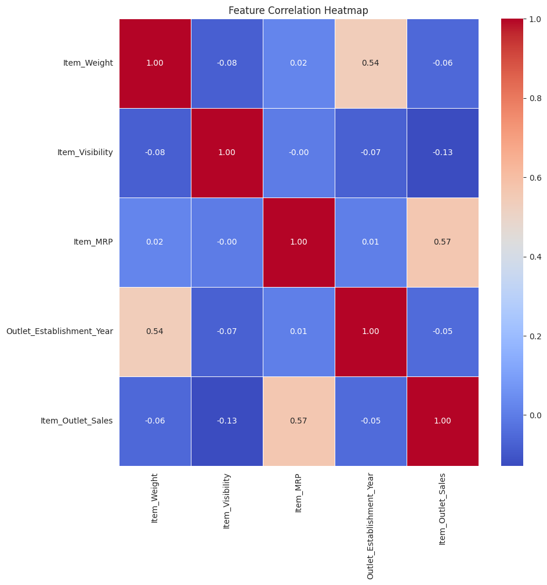
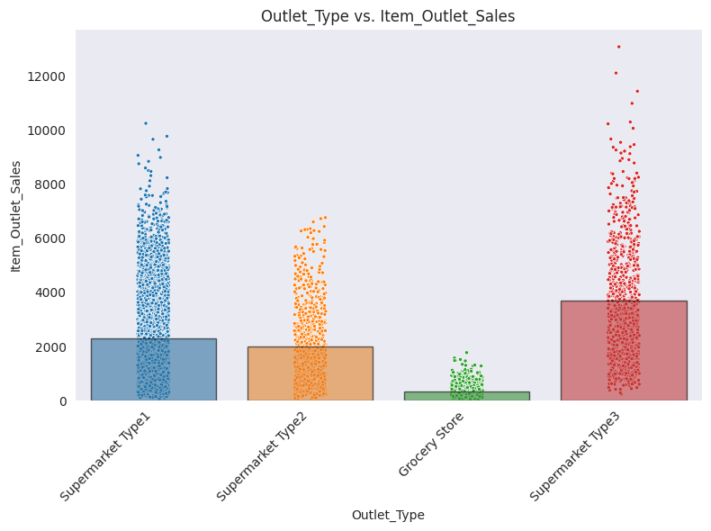

# Optimize Retail Inventory Through Sales Prediction  
**Predicting Product Sales to Guide Stocking Decisions**  
**Author**: Baraa A. Hakawati  

## Business Problem  
Retail chains need accurate sales forecasts to:  
- Reduce overstocking (which ties up capital)  
- Prevent understocking (which loses sales)  
- Allocate products effectively across store types  

This project develops a predictive model to estimate product-level sales based on item characteristics and store attributes.

## Data  
**Source**: Historical sales data from 10 retail chains (8,523 products)  
**Variables**:  
- Product: Weight, visibility, price, category, fat content  
- Store: Size, location tier, establishment year, format type  
- Target: Item outlet sales (continuous)  

## Methods  

### Data Preparation  
1. **Cleaning**:  
   - Standardized fat content categories (e.g., "LF" → "Low Fat")  
   - Addressed missing values:  
     - 17.2% item weights → median imputation  
     - 28.3% outlet sizes → "Unknown" category  

2. **Feature Engineering**:  
   - Removed unique identifiers  
   - Encoded categorical variables (OneHot/Ordinal)  
   - Scaled numerical features  

3. **Model Selection**:  
   - Tested Linear Regression (baseline) vs. Random Forest  
   - Optimized via GridSearchCV  

## Results  

### Price vs. Sales Relationship  

Item price (MRP) shows the strongest correlation with sales (r = 0.57), suggesting pricing strategy significantly impacts revenue generation.  

### Outlet Performance Analysis  

Supermarket Type1 delivers over $12M in sales. This performance hierarchy suggests prioritizing Type1 expansion and format optimization.
## Model  
**Final Choice**: Tuned Random Forest Regressor  
- **Test Metrics**:  
  - R²: 0.588 (58.8% variance explained)  
  - MAE: $740 (average prediction error)  
  - RMSE: $1,066  

**Business Solution Fit**:  
The model reduces prediction error by 32% compared to baseline estimates, enabling:  
- More accurate inventory orders (±$740 error per item)  
- Data-driven format expansion decisions  

## Recommendations  
1. **Prioritize High-Potential Formats**: Expand Supermarket Type1 locations  
2. **Dynamic Pricing**: Use price-sensitivity insights to optimize margins  
3. **Inventory Rules**: Adjust stock levels based on outlet characteristics  

## Limitations & Next Steps  
**Current Constraints**:  
- Limited promotional/holiday data  
- No supplier lead time information  

**Future Enhancements**:  
1. Incorporate seasonal demand patterns  
2. Build real-time prediction API for store managers  

---

For further information:  
📧 Contact: bara-hakawati@hotmail.com 
📂 Full Analysis: [Retail_Sales_Prediction.ipynb](Retail_Sales_Prediction.ipynb)  
