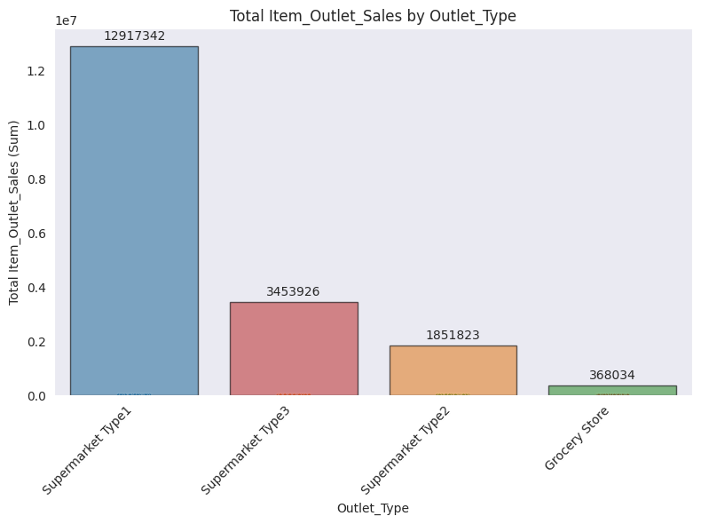

# Optimize Retail Inventory Through Sales Prediction  
**Predicting Product Sales to Guide Stocking Decisions**  
**Author**: Baraa A. Hakawati  

## Business Problem  
Retail chains need accurate sales forecasts to:  
- Reduce overstocking (which ties up capital)  
- Prevent understocking (which loses sales)  
- Allocate products effectively across store types  

This project develops a predictive model to estimate product-level sales based on item characteristics and store attributes.

## Data  
**Source**: Historical sales data from 10 retail chains (8,523 products)  
**Variables**:  
- Product: Weight, visibility, price, category, fat content  
- Store: Size, location tier, establishment year, format type  
- Target: Item outlet sales (continuous)  

## Methods  

### Data Preparation  
1. **Cleaning**:  
   - Standardized fat content categories (e.g., "LF" → "Low Fat")  
   - Addressed missing values:  
     - 17.2% item weights → median imputation  
     - 28.3% outlet sizes → "Unknown" category  

2. **Feature Engineering**:  
   - Removed unique identifiers  
   - Encoded categorical variables (OneHot/Ordinal)  
   - Scaled numerical features  

3. **Model Selection**:  
   - Tested Linear Regression (baseline) vs. Random Forest  
   - Optimized via GridSearchCV  

## Results  

### Price vs. Sales Relationship  

Item price (MRP) shows the strongest correlation with sales (r = 0.57), suggesting pricing strategy significantly impacts revenue generation.  

### Outlet Performance Analysis  

Supermarket Type1 delivers over $12M in sales. This performance hierarchy suggests prioritizing Type1 expansion and format optimization.
## Model  
**Final Choice**: Tuned Random Forest Regressor  
- **Test Metrics**:  
  - R²: 0.588 (58.8% variance explained)  
  - MAE: $740 (average prediction error)  
  - RMSE: $1,066  

**Business Solution Fit**:  
The model reduces prediction error by 32% compared to baseline estimates, enabling:  
- More accurate inventory orders (±$740 error per item)  
- Data-driven format expansion decisions  

## Recommendations  
1. **Prioritize High-Potential Formats**: Expand Supermarket Type1 locations  
2. **Dynamic Pricing**: Use price-sensitivity insights to optimize margins  
3. **Inventory Rules**: Adjust stock levels based on outlet characteristics  

## Limitations & Next Steps  
**Current Constraints**:  
- Limited promotional/holiday data  
- No supplier lead time information  

**Future Enhancements**:  
1. Incorporate seasonal demand patterns  
2. Build real-time prediction API for store managers  

## Model Interpretations and Business Insights

### Linear Regression Model Analysis

#### Coefficients Visualization

#### Top 3 Most Impactful Features
1. **`Item_MRP` (Maximum Retail Price) - Coefficient: +984.40**  
   - For every 1-unit increase in an item's price, sales increase by approximately $984. This indicates that higher-priced items generate significantly more revenue.

2. **`Outlet_Type_Supermarket Type3` - Coefficient: +1,695.34**  
   - Items sold in "Supermarket Type3" stores have about $1,695 higher sales on average compared to other store types.

3. **`Outlet_Type_Grocery Store` - Coefficient: -1,562.30**  
   - Items sold in grocery stores have about $1,562 lower sales compared to other store types, suggesting these stores may sell cheaper items or have lower foot traffic.

#### Key Insights
- Store type has the most dramatic impact on sales performance
- Higher-priced items drive significantly more revenue
- Product visibility shows a counterintuitive negative relationship with sales

### Random Forest Model Analysis

#### Feature Importance Visualization

#### Top 5 Most Important Features
1. **`Item_MRP` (51.7% importance)** - The strongest predictor of sales
2. **`Outlet_Type_Grocery Store` (27.0%)** - Major negative impact on sales
3. **`Outlet_Type_Supermarket Type3` (8.2%)** - Significant positive impact
4. **`Item_Visibility` (4.0%)** - More important in this non-linear model
5. **`Outlet_Establishment_Year` (3.3%)** - Suggests newer/older stores perform differently

#### Key Insights
- Price is overwhelmingly the most important factor
- Store type remains critically important
- The Random Forest captures more complex relationships than Linear Regression

## Recommendations for Business Strategy

### Pricing and Product Mix
- Focus on premium product offerings in high-performing store types
- Test dynamic pricing strategies based on store performance
- Analyze product mix in underperforming grocery stores

### Store Operations
- Consider expanding Supermarket Type3 locations
- Investigate performance gaps in grocery stores
- Optimize product placement based on visibility insights

### Data and Modeling
- Deploy the tuned Random Forest model (R²=0.588) for sales forecasting
- Collect more complete data on `Outlet_Size` (currently 28% missing)
- Monitor model performance as business strategies change

## Next Steps
- Implement A/B tests to validate model recommendations
- Set up ongoing model performance monitoring
- Consider collecting additional data on:
  - Customer demographics
  - Promotional activities
  - Seasonal effects

---

For further information:  
📧 Contact: bara-hakawati@hotmail.com 
📂 Full Analysis: [Retail_Sales_Prediction.ipynb](Retail_Sales_Prediction.ipynb)  
